<p align="center">
  
</p>

<h1 align="center">Run Pilot · Conductor</h1>

<p align="center">
  <strong>Aplicación móvil de transporte urbano inteligente para conductores y pilotos profesionales en Lima, Perú.</strong><br>
  Donde los conductores reciben solicitudes en tiempo real, gestionan sus viajes y maximizan sus ingresos con herramientas nativas multitarea.
</p>

<p align="center">
  <a href="https://reactnative.dev"></a>
  <a href="https://expo.dev"></a>
  <a href="https://www.typescriptlang.org"></a>
  <a href="https://jestjs.io"></a>
  <a href="https://developer.android.com"></a>
  
  85%25-success" alt="Coverage" />
  
</p>

---

## 📱 Capturas de Pantalla (Preview)

> Capturas tomadas en un emulador Android (Google Pixel) con la versión oficial de Run Pilot.

### Acceso

| 01. Splash | 02. Login | 03. Código |
| :---: | :---: | :---: |
|  | 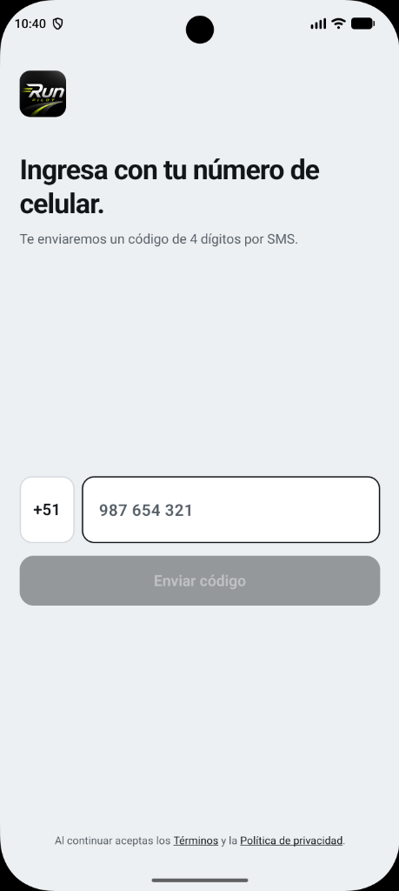 | 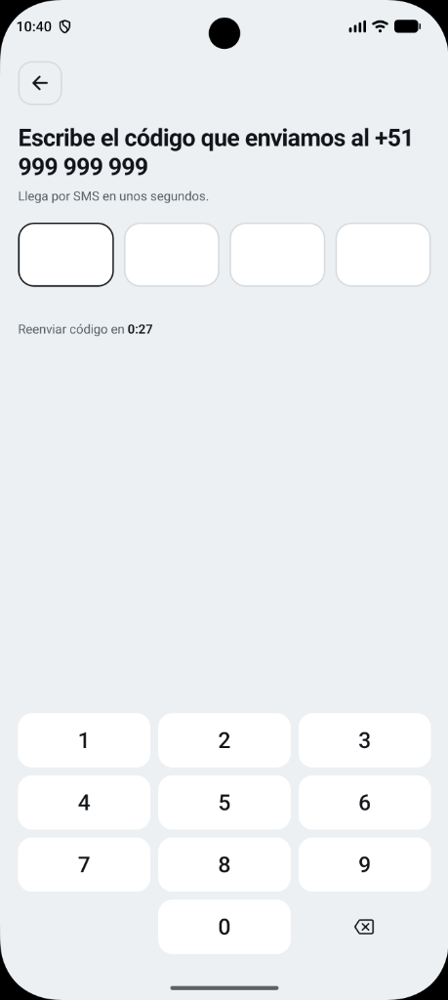 |
| *Logo de Run Pilot con barra*<br>*de carga inicial* | *Número con prefijo de*<br>*país y acceso conductor* | *Código de 4 dígitos con*<br>*teclado propio* |

### Flujo de Conducción y Viaje

| 04. Inicio | 05. Segundo Plano | 06. Solicitud | 07. En Viaje |
| :---: | :---: | :---: | :---: |
| 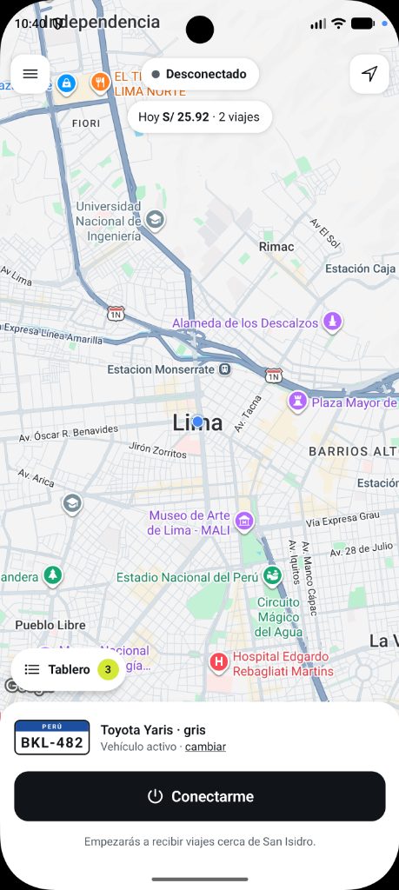 | 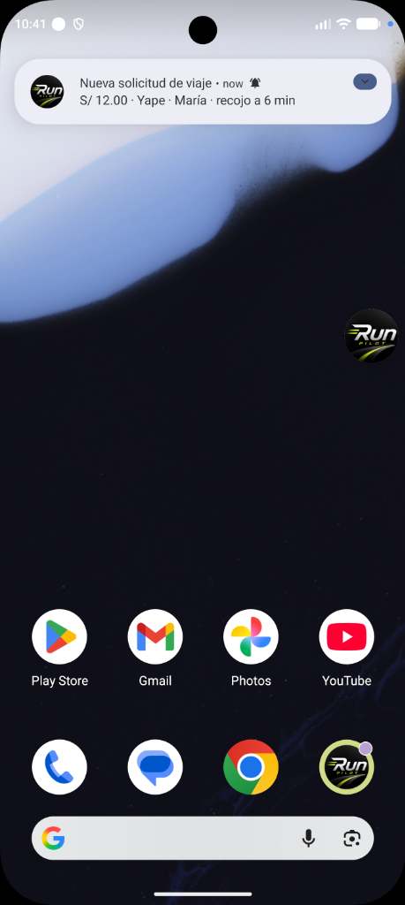 | 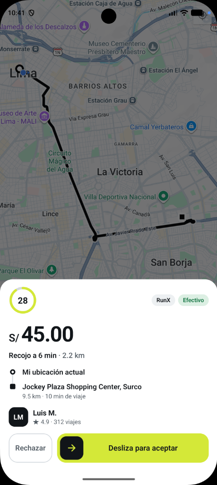 | 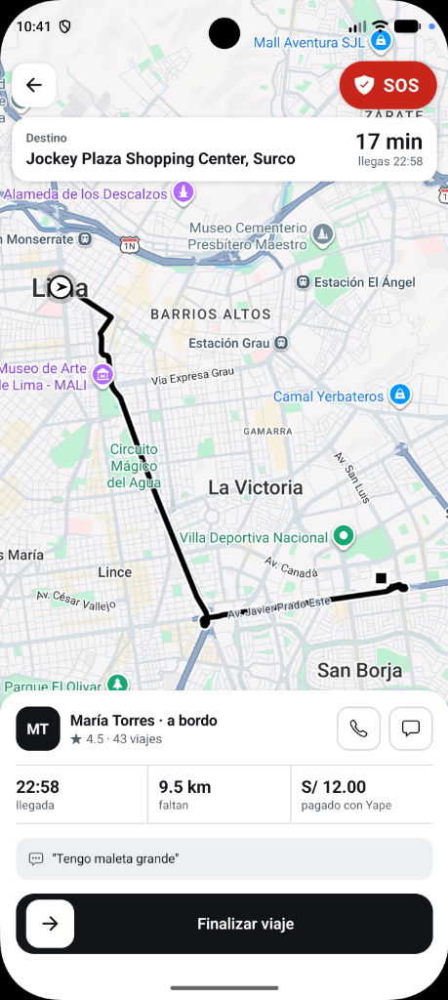 |
| *Mapa con estado desconectado*<br>*y botón para conectarse* | *Burbuja flotante activa y*<br>*notificación heads-up* | *Alerta de carrera, tarifa S/ 45*<br>*y slider para aceptar* | *Ruta hacia destino, SOS,*<br>*método de pago y finalizar* |

### Multitarea y Gestión de Carreras

| 08. Permiso | 09. Menú | 10. Tablero | 11. Billetera |
| :---: | :---: | :---: | :---: |
| 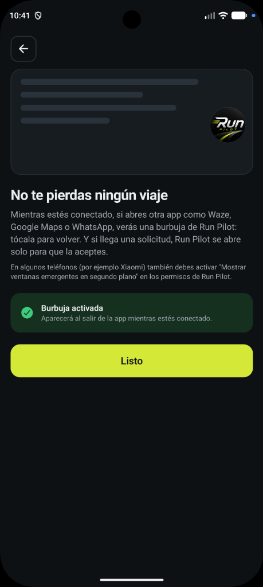 | 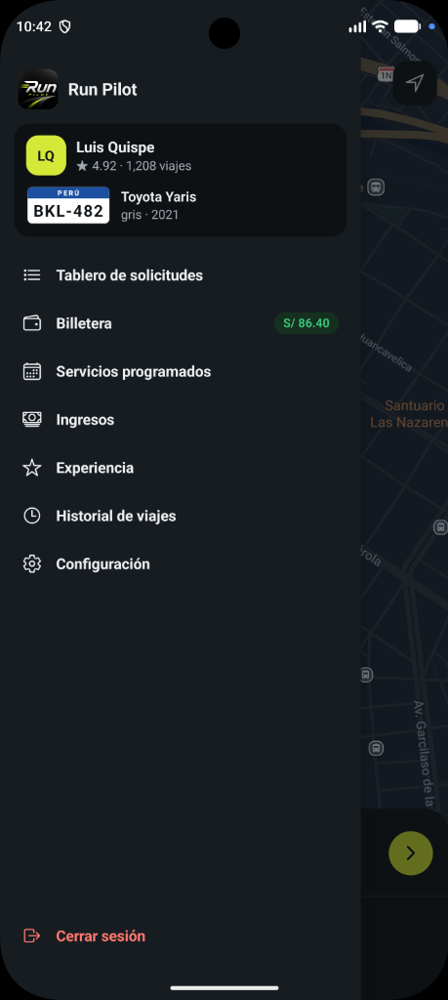 | 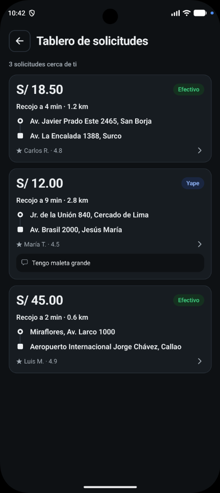 | 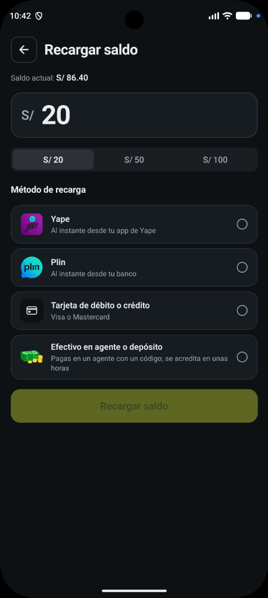 |
| *Configuración del permiso*<br>*SYSTEM_ALERT_WINDOW* | *Perfil del conductor, vehículo,*<br>*ingresos y accesos directos* | *Lista de carreras disponibles*<br>*cercanas con distancias y tarifas* | *Gestión de saldo con Yape,*<br>*Plin, tarjeta o efectivo* |

### Historial, Calificaciones y Modo Oscuro

| 12. Historial | 13. Experiencia | 14. Modo Claro | 15. Modo Oscuro |
| :---: | :---: | :---: | :---: |
| 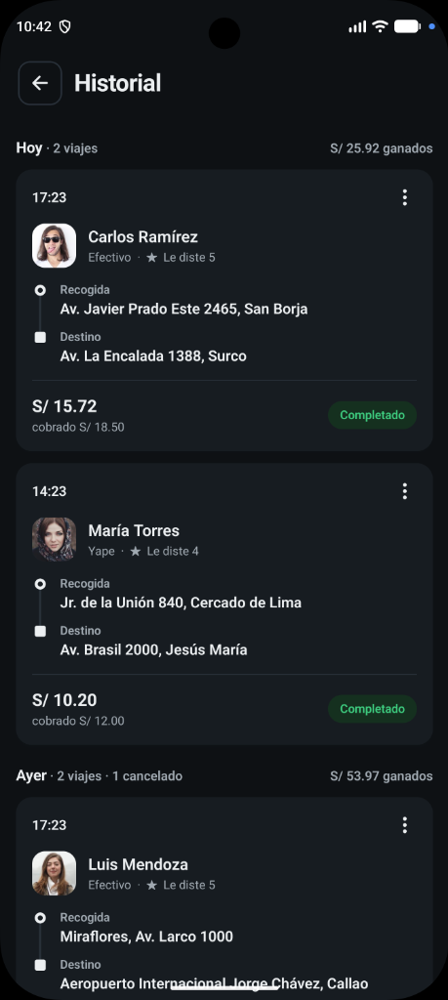 | 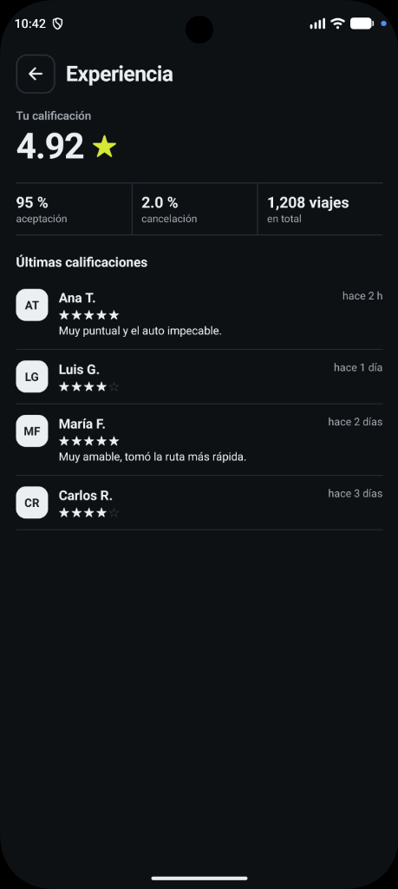 | 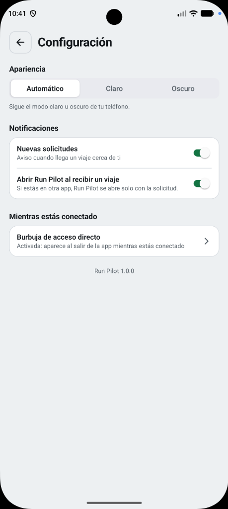 | 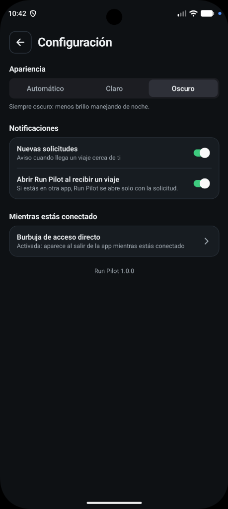 |
| *Registro de viajes completados*<br>*y ganancias acumuladas* | *Calificación 4.92★, tasa del*<br>*95% y reseñas de pasajeros* | *Tema claro, alertas de auto-apertura*<br>*y gestión de la burbuja* | *Tema oscuro completo adaptado*<br>*para conducción nocturna* |

---

## ⚡ Características Principales

- **🚕 Recepción Inteligente de Solicitudes:**
  - Panel emergente dinámico con cuenta regresiva para responder (`IncomingRequestOverlay`).
  - Deslizador gestual para confirmar el servicio (`Desliza para aceptar`) y botón de rechazo.
  - Información transparente por servicio: tarifa en moneda local (**S/**), distancia y tiempo de recojo, distancia de viaje, método de pago, datos y calificación del pasajero.
- **🔔 Notificaciones y Auto-Apertura en Segundo Plano:**
  - Canal de notificaciones nativas de alta prioridad (`MAX`) con sonido.
  - Temporizador diferido en hilo principal nativo (`Looper.getMainLooper()` y `AlarmManager`): si el conductor está usando otra aplicación (ej. Waze o WhatsApp), recibe la notificación y tras 4 segundos la app se abre automáticamente directo en la pantalla de aceptación.
- **🎈 Burbuja Flotante Multitarea (Overlay Widget):**
  - Módulo nativo propio en **Kotlin** para Android (`SYSTEM_ALERT_WINDOW`).
  - Widget flotante interactivo y arrastrable (`drag & drop`) que permanece en pantalla mientras se navega con apps externas.
  - Retorno instantáneo a **Run Pilot** con un solo toque.
- **🛡️ Servicio en Primer Plano Desacoplado:**
  - `Foreground Service` nativo que mantiene viva la app en segundo plano mientras el conductor está conectado o en viaje, sin depender del permiso de la burbuja.
- **🗺️ Navegación y Mapa en Vivo con Google Maps:**
  - Renderizado nativo con `react-native-maps` y Google Maps SDK.
  - Trazado de polilíneas de ruta en tiempo real, geocodificación y cálculo de trayecto por fases: *Hacia el punto de recojo*, *En espera del pasajero*, *En viaje* y *Llegada a destino*.
- **💼 Billetera Digital y Finanzas:**
  - Balance de saldo disponible en tiempo real.
  - Recargas y retiros compatibles con métodos locales (**Yape**, **Plin** y **Transferencia Bancaria**).
  - Resumen métrico de ganancias por día, semana y mes con contador de viajes completados.
- **🗓️ Servicios Programados e Historial:**
  - Agenda para reserva y seguimiento de viajes agendados con anticipación.
  - Historial detallado de servicios completados y cancelados agrupados por fecha.
- **🌗 Design System y Modo Oscuro:**
  - Modo Claro (*Light*) y Modo Oscuro (*Dark*) sincronizado con el sistema o seleccionable manualmente.
  - Persistencia segura del tema mediante `expo-secure-store`.
  - Animaciones fluidas a 60 fps con `react-native-reanimated` y feedback háptico (`expo-haptics`).

---

## 🏗️ Arquitectura y Tecnologías

El proyecto sigue una arquitectura modular guiada por el dominio (**Feature-Driven Architecture**):

```text
Run_Pilot/
├── App.tsx                     # Punto de entrada, proveedores de tema y navegación
├── app.json                    # Configuración central de Expo, permisos y plugins
├── docs/                       # Documentación y capturas
│   └── screenshots/            # Capturas del flujo móvil del conductor
├── modules/
│   └── burbuja-flotante/       # Módulo nativo en Kotlin (Overlay, Servicio y Looper nativo)
│       ├── android/            # Código nativo Kotlin y tests unitarios en Robolectric
│       └── index.ts            # Declaraciones TypeScript y puente JSI de Expo
├── src/
│   ├── config/                 # Constantes de entorno y claves API
│   ├── data/                   # Datos locales y mocks de conductores/solicitudes
│   ├── features/               # Módulos organizados por dominio
│   │   ├── auth/               # Login, verificación y Splash screen
│   │   ├── conductor/          # Ecosistema del conductor
│   │   │   ├── avisos/         # Notificaciones locales, retardo nativo y lifecycle
│   │   │   ├── billetera/      # Balance, recargas y retiros
│   │   │   ├── burbuja/        # Lógica de permiso y ciclo de vida de la burbuja
│   │   │   ├── calificar/      # Valoración de pasajeros post-carrera
│   │   │   ├── configuracion/  # Preferencias de sonido, auto-apertura y burbuja
│   │   │   ├── cuenta/         # Perfil, documentos y datos del conductor
│   │   │   ├── historial/      # Registro agrupado de carreras
│   │   │   ├── home/           # Pantalla principal con mapa, radar y solicitudes
│   │   │   ├── ingresos/       # Reportes de recaudación y estadísticas
│   │   │   ├── servicios-programados/# Viajes agendados
│   │   │   ├── vehiculo/       # Datos y cambio de vehículo asignado
│   │   │   └── viaje/          # Seguimiento del viaje activo y panel de pago
│   │   └── dev/                # Catálogo de componentes y pruebas de UI
│   ├── navigation/             # Configuración de React Navigation 7
│   ├── shared/                 # Componentes UI reutilizables, hooks y utilidades geo/cálculo
│   ├── store/                  # Estado global reactivo con Zustand
│   └── theme/                  # Tokens de diseño (Colores, Spacing, Fuentes, Motion)
└── package.json                # Dependencias y scripts de ejecución
```

---

## 🎈 Módulo Nativo: Burbuja Flotante

Ubicado en `modules/burbuja-flotante`, este módulo nativo implementa capacidades avanzadas del sistema operativo Android:

1. **Gestor de Ventana Flotante (`BurbujaVista.kt` & `BurbujaManager.kt`):** Dibuja una vista flotante utilizando `WindowManager.LayoutParams.TYPE_APPLICATION_OVERLAY`. Incluye soporte de física táctil (`OnTouchListener`) para arrastrar la burbuja a cualquier punto de la pantalla y anclarla a los bordes.
2. **Servicio en Primer Plano (`BurbujaServicio.kt`):** Canal de servicio en primer plano persistente (`FOREGROUND_SERVICE`) para evitar que Android cierre el proceso de la app al pasar a segundo plano.
3. **Apertura Programada Nativa (`programarApertura` / `cancelarApertura`):** Al recibir una carrera en segundo plano, se programa la apertura en el `Handler(Looper.getMainLooper())` nativo. Esto garantiza que la app se abra sin verse afectada por la suspensión de temporizadores de JavaScript en segundo plano de React Native.

---

## 🚀 Comenzando

### Requisitos Previos

- **Node.js**: `v20.x` o superior
- **JDK**: **Java 21 LTS** *(configurado en `android/gradle.properties`)*
- **Android Studio**: Android SDK Platform 36 (`compileSdk 36`, `targetSdk 36`), NDK 27.x y herramientas de compilación
- **Emulador / Dispositivo Android**: Android 12 o superior (Recomendado: Android 14/15 con Google APIs)
- **Watchman**: `brew install watchman` (en macOS)

### 1. Clonar el repositorio

```bash
git clone https://github.com/VMichael1999/Run_Pilot.git
cd Run_Pilot
```

### 2. Instalar dependencias

```bash
npm install
```

### 3. Variables de Entorno

Crea un archivo `.env` en la raíz del proyecto y configura tu clave de Google Maps:

```bash
cp .env.example .env
```

Edita `.env`:
```env
EXPO_PUBLIC_GOOGLE_MAPS_API_KEY=tu_google_maps_api_key_aqui
```

---

## 💻 Ejecución del Proyecto

> ⚠️ **Nota de Red:** En el ecosistema Run, `Run_Driver` (pasajeros) opera en el puerto `8081` y **`Run_Pilot` (conductores) opera en el puerto `8082`**.

### 1. Iniciar Metro Bundler (Puerto 8082)

```bash
npm run start
```
*(El script ejecuta automáticamente `expo start --port 8082`)*.

### 2. Ejecutar en Android (Emulador o Dispositivo)

Configura el túnel ADB para el puerto 8082:
```bash
adb -s emulator-5554 reverse tcp:8082 tcp:8082
```

Compila e instala el APK de depuración:
```bash
cd android
export PATH="$HOME/.local/node/bin:$PATH" && ./gradlew assembleDebug
cd ..
adb -s emulator-5554 install -r android/app/build/outputs/apk/debug/app-debug.apk
```

---

## 🧪 Pruebas y Calidad de Código

El proyecto cuenta con una cobertura integral de pruebas unitarias y verificación estricta de tipos:

### 1. Pruebas Unitarias de React Native (Jest)
Ejecuta las **34 suites de pruebas** (233 tests automatizados):
```bash
# Ejecutar todas las pruebas con reporte
npm run test:ci

# Modo watch interactivo durante desarrollo
npm test
```

### 2. Verificación de Tipos (TypeScript)
```bash
npx tsc --noEmit
```

### 3. Pruebas Nativas de Kotlin (Robolectric)
Prueba la lógica del servicio en segundo plano y el overlay flotante en la JVM:
```bash
cd android
./gradlew :burbuja-flotante:testDebugUnitTest
```

### Estado de las Pruebas:
```text
Test Suites: 34 passed, 34 total
Tests:       233 passed, 233 total
Snapshots:   0 total
Coverage:    > 85% de cobertura general
```

---

## 📌 Guía de Uso del Flujo Demo (Conductor)

Para probar el flujo completo de simulación en el emulador:

1. **Acceso:** En la pantalla de Login, ingresa tu número o utiliza el acceso demo para entrar a la pantalla principal.
2. **Conectarse:** Toca el botón central **"Conectarse"**. El radar de búsqueda se activará y el servicio en primer plano mantendrá la app viva.
3. **Probar Segundo Plano:**
   - Minimiza la aplicación (presiona *Home*).
   - Observa cómo la **burbuja flotante** aparece automáticamente en la pantalla de inicio del teléfono.
   - En 4 segundos, se disparará una solicitud de viaje simulada: recibirás la **notificación push con sonido** y la aplicación se abrirá sola trayendo la pantalla de aceptación al frente.
4. **Aceptar y Realizar Carrera:**
   - Desliza el control **"Desliza para aceptar"**.
   - Sigue la ruta en el mapa en vivo hacia el punto de recojo del pasajero.
   - Toca **"Llegué al punto"** y luego **"Iniciar viaje"**.
   - Avanza hasta el destino y toca **"Finalizar viaje"** para acceder al panel de cobro (Efectivo / Yape).
5. **Configuración:** Puedes ajustar el comportamiento de la burbuja, los avisos sonoros y la auto-apertura desde la pestaña **Configuración**.

---

## 👥 Contribución y Créditos

Desarrollado como parte de la plataforma **Run Pilot / RunSubasta**.

- **Repositorio:** [VMichael1999/Run_Pilot](https://github.com/VMichael1999/Run_Pilot)
- **Rama principal:** `main`

---

<p align="center">
  <b>Run Pilot</b> · Hecho con precisión para conductores profesionales 🚕
</p>
